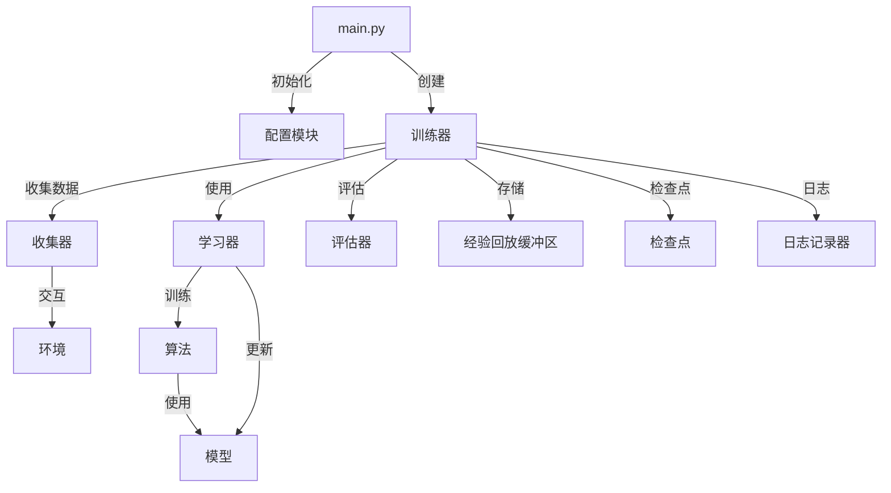
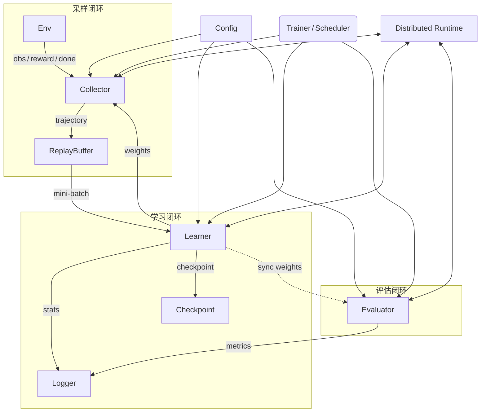

# RLib

<div align="center">
    
    <p>一个高效、可扩展的强化学习框架</p>
    <a href="https://github.com/jelech/rl/stargazers"></a>
    <a href="https://github.com/jelech/rl/network/members"></a>
    <a href="https://github.com/jelech/rl/pulls"></a>
    <a href="https://github.com/jelech/rl/issues"></a>
    <a href="https://github.com/jelech/rl/blob/master/LICENSE"></a>
</div>

## 📖 简介

RLib 是一个高效、可扩展的强化学习框架，提供了一套完整的工具链，包括不同的算法实现、环境模拟、分布式训练支持以及评估功能。本框架适合研究人员使用，可以快速搭建和测试新的强化学习策略。

### 🌟 核心特性

- **模块化设计**：每个组件都可以独立工作和替换，方便扩展和定制
- **多算法支持**：内置多种强化学习算法，如PPO等
- **分布式训练**：支持Ray分布式和PyTorch DDP分布式训练
- **丰富的环境**：包含多种环境接口，支持自定义环境
- **易于配置**：支持JSON和YAML配置文件，灵活调整参数
- **性能优化**：核心模块env支持C++调用实现，提供高性能计算

## 🏗️ 架构

模块架构如下


调用关系如下:


### 📋 模块说明

- **algorithm**: 实现了多种强化学习算法（PPO等）
- **buffer**: 经验回放缓冲区，存储和管理训练数据
- **collector**: 数据收集器，负责智能体与环境的交互和数据收集
- **config**: 配置管理，支持从JSON/YAML加载和保存配置
- **core**: 核心训练逻辑，包括训练器和检查点管理
- **envs**: 各种环境实现，包括自定义环境和Gym风格环境
- **evaluator**: 评估模块，用于评估训练后的策略
- **learner**: 学习器，负责根据收集的数据更新模型
- **model**: 策略和价值网络模型实现
- **utils**: 工具函数，包括日志记录等

## 🚀 快速开始

### 安装

```bash
# 克隆仓库
git clone https://github.com/jelech/rl.git
cd rl

# 安装依赖
pip install -r requirements.txt

# 如果需要编译C++扩展
cd envs/self_envs/cpp
make
```

### 基本使用

1. 准备配置文件 (config.json):

```json
{
  "env": {
    "env_id": "CartPole-v1",
    "num_envs": 8
  },
  "algorithm": {
    "name": "ppo",
    "clip_ratio": 0.2,
    "value_coef": 0.5,
    "entropy_coef": 0.01
  },
  "model": {
    "actor_hidden_sizes": [64, 64],
    "critic_hidden_sizes": [64, 64]
  },
  "training": {
    "total_episodes": 1000,
    "learning_rate": 0.0003,
    "batch_size": 64,
    "eval_interval": 10
  }
}
```

2. 运行训练:

```bash
# 单机训练
python main.py

# 使用Ray分布式训练: 多collector采样
python main.py --ray --num_actors 8

# 使用PyTorch DDP分布式训练: 多leaner同步训练
python main.py --ddp
```

3. 查看结果:

训练日志和检查点将保存在outputs目录中。您可以使用TensorBoard查看训练进度:

```bash
tensorboard --logdir outputs/logs
```

或者如果使用了mlflow进行实验跟踪，可以使用以下命令查看实验结果: 

```bash
mlflow ui
```

## 🧩 示例代码

### 自定义环境

```python
from envs.env import BaseEnv

class MyCustomEnv(BaseEnv):
    def __init__(self, config):
        super().__init__(config)
        # 自定义初始化逻辑

    def reset(self):
        # 重置环境
        return initial_state
        
    def step(self, action):
        # 执行动作并返回新状态
        return next_state, reward, done, info
```

### 自定义算法

```python
from algorithm.base import BaseAlgorithm

class MyAlgorithm(BaseAlgorithm):
    def __init__(self, config):
        super().__init__(config)
        # 自定义初始化逻辑

    def update(self, batch):
        # 实现算法更新逻辑
        return metrics
```

## 🤝 贡献指南

我们欢迎各种形式的贡献，包括但不限于:

- 报告问题和提出建议
- 提交代码改进和新功能
- 改进文档和示例
- 分享您使用该框架的经验和案例

请参阅 [CONTRIBUTING.md](CONTRIBUTING.md) 了解更多详情。

## 📜 引用

如果您在研究中使用了RL框架，请引用我们的工作:

```bibtex
@misc{rl2025,
  author = {Jelech},
  title = {RLib: A Modular Reinforcement Learning Framework},
  year = {2025},
  publisher = {GitHub},
  journal = {GitHub Repository},
  howpublished = {\url{https://github.com/jelech/rl}}
}
```

## 📄 许可证

该项目采用 [MIT 许可证](LICENSE)。

## 👥 团队

- Jelech - 项目负责人